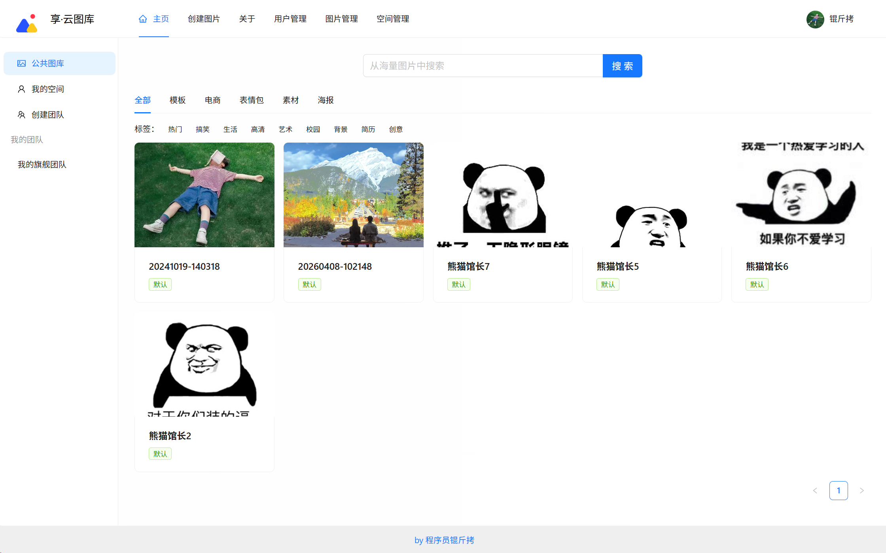
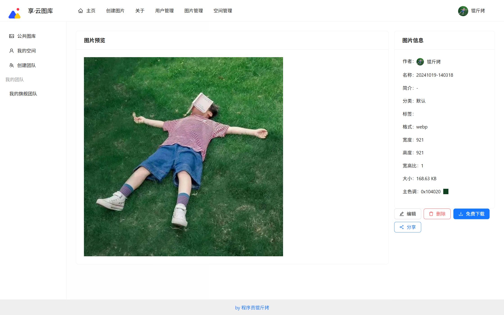
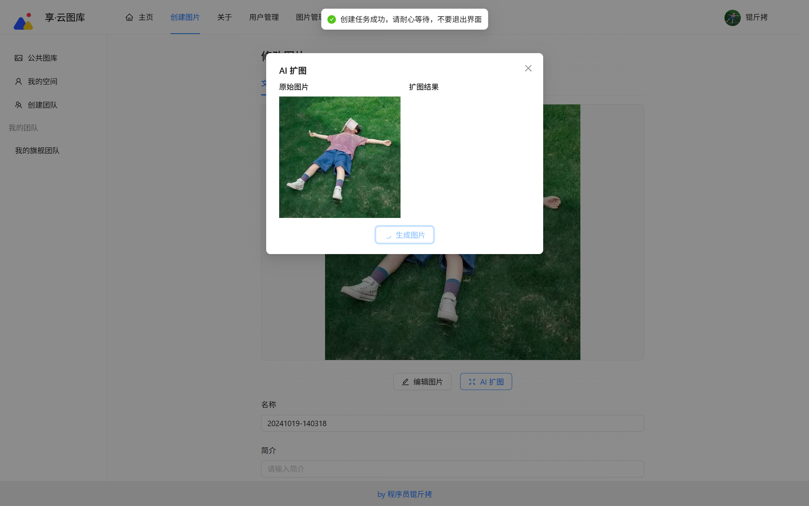
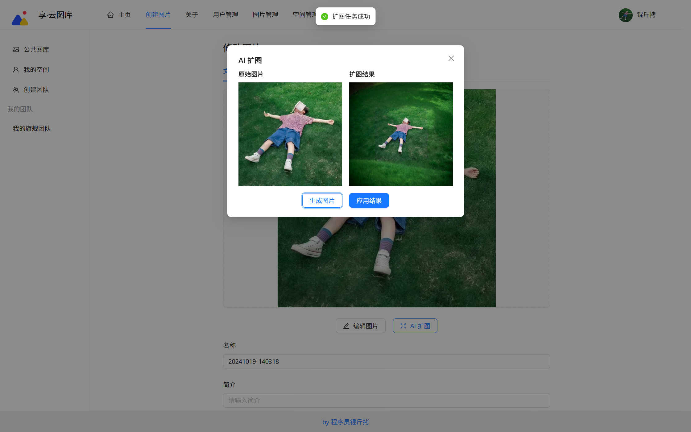
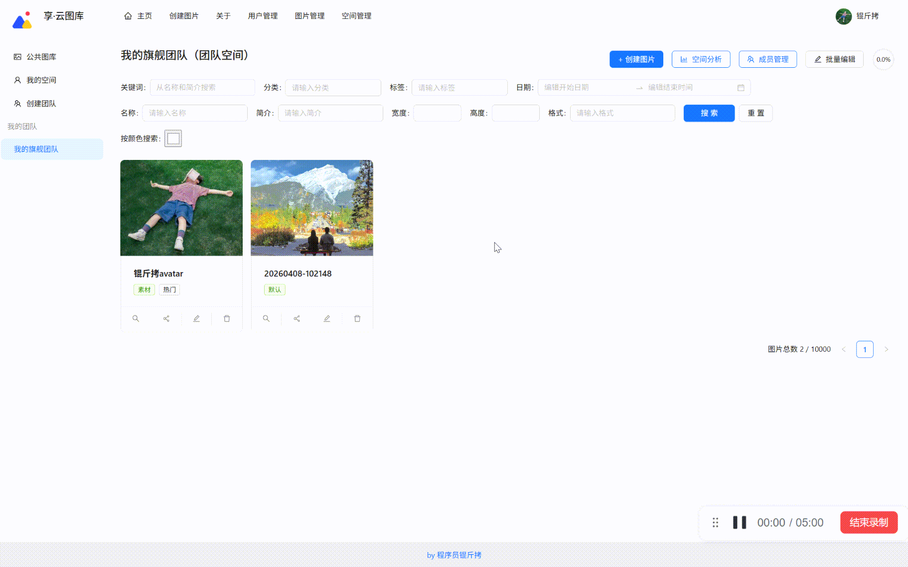
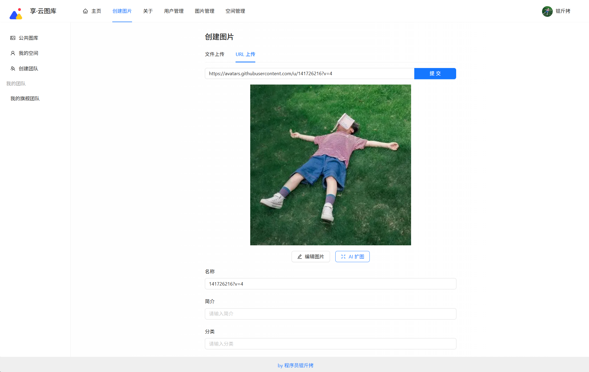
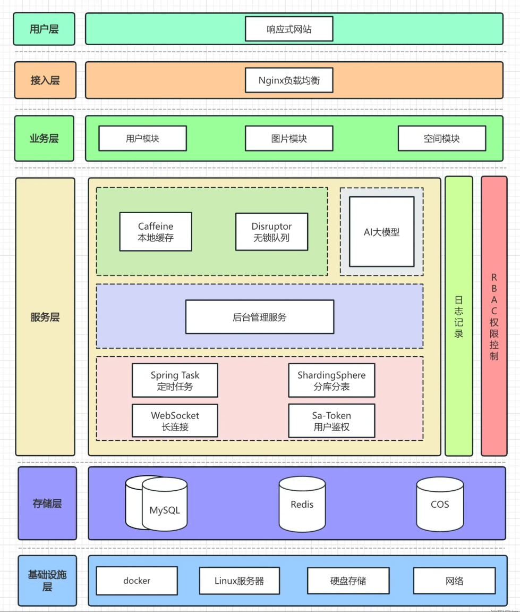

<p align="center">
  <a href="https://github.com/xiangxiang62/xiangPic">
    
  </a>
</p>

<h1 align="center">享 智能协同云图库</h1>

<p align="center">
  <strong>智绘影像，云端共创 —— 一款为团队而生的 AI 驱动型多人协作云图库。</strong>
</p>

<p align="center">
  <a href="https://github.com/xiangxiang62/xiangPic/stargazers"></a>
  <a href="https://github.com/xiangxiang62/xiangPic/network/members"></a>
  
  
  
</p>

---

## 📖 项目简介

**享 智能协同云图库** 是一款深度集成 AI 技术的多人协作图像管理平台。它不仅提供稳定可靠的云端存储，更通过 AI 自动化处理（如智能扩图、颜色搜索）和精细化的团队空间管理，解决企业和团队在图片管理、协作流转及智能搜索方面的痛点。

> **🎯 核心价值**：把繁琐的图片分类交给 AI，把高效的协同留给团队。

---

## ✨ 核心功能展示

### 🖼️ 极简首页与详情
| 响应式首页 | 图片详情页 |
| :---: | :---: |
|  |  |

### 🤖 AI 智能引擎
* **智能扩图**：基于 AI 大模型对图片边缘进行自然填充，解决比例适配难题。
* **以色找图**：毫秒级颜色提取，支持根据主色调精准检索。

| AI 扩图处理前 | AI 扩图处理后 |
| :---: | :---: | 
|  |   |



### 👥 团队协同与上传
* **极致上传**：支持拖拽上传、URL 远程采集，集成腾讯云 COS，毫秒级快速预览。
* **RBAC 权限体系**：精细化控制成员权限（管理员、编辑者、查看者），确保资源安全。

| 上传交互 | 团队协作 |
| :---: | :---: |
|  |  |

---

## 🛠️ 技术架构

项目采用高性能的前后端分离架构方案：

- **前端**：`Vue 3` + `Ant Design Vue` + `Pinia` + `Vite` + `TypeScript`
- **后端**：`Java 17` + `Spring Boot 3` + `MyBatis-Plus` + `MySQL` + `Redis`
- **极致优化**：使用 `Caffeine` 局部缓存、`Disruptor` 无锁队列优化高并发场景下的数据写入。
- **云原生**：腾讯云 `COS` (对象存储) + `CI` (数据万象 AI 处理)。


 **系统架构图**
 

---

## 🚀 快速开始

### 1. 环境准备
- JDK 17+
- MySQL 8.0+
- Redis 6.x+
- Node.js 18+

### 2. 克隆项目
```bash
git clone [https://github.com/xiangxiang62/xiangPic.git](https://github.com/xiangxiang62/xiangPic.git)
````

### 3\. 后端配置

1.  运行 `sql/` 目录下的 SQL 文件初始化数据库。
2.  在 `src/main/resources/application.yml` 中配置 MySQL、Redis 以及腾讯云 COS 秘钥。
3.  启动 `XiangPicApplication` 类。

### 4\. 前端启动

```bash
cd xiang-pic-frontend
npm install
npm run dev
```

-----

## 📈 Star History

<a href="https://www.star-history.com/?repos=xiangxiang62%2FxiangPic&type=date&logscale=&legend=top-left">
 <picture>
   <source media="(prefers-color-scheme: dark)" srcset="https://api.star-history.com/chart?repos=xiangxiang62/xiangPic&type=date&theme=dark&logscale&legend=top-left" />
   <source media="(prefers-color-scheme: light)" srcset="https://api.star-history.com/chart?repos=xiangxiang62/xiangPic&type=date&logscale&legend=top-left" />
   
 </picture>
</a>

-----

## 🤝 参与贡献

欢迎通过 Pull Request 或 Issue 来帮助完善项目！

1.  Fork 本项目
2.  创建分支 (`git checkout -b feature/NewFeature`)
3.  提交修改 (`git commit -m 'feat: add some amazing feature'`)
4.  推送分支 (`git push origin feature/NewFeature`)
5.  发起 Pull Request

-----


如果这个项目对你有帮助，欢迎点个 Star⭐，这将是对作者最大的支持！

